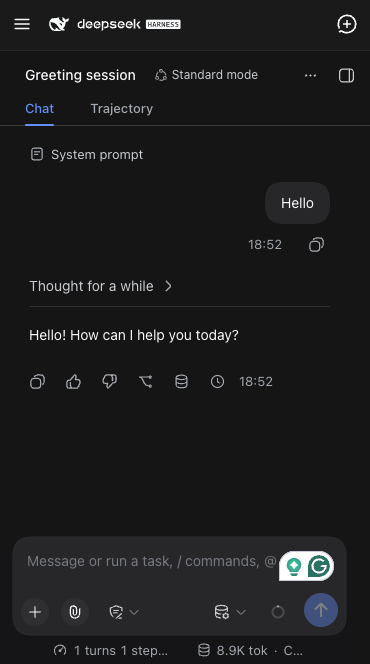

# dsh-mobile-topbar

A [DeepSeek Harness](https://github.com/deepseek-ai/deepseek-harness) Web UI plugin that turns the sidebar into a compact top bar on mobile screens, to save some precious space on small devices.

<p align="center">
  
</p>

## Why

DSH's left sidebar (session list, workspaces, settings) reserves a real grid column even in its collapsed "rail" state. On a phone that's a meaningful chunk of a small screen given up permanently. This plugin removes that reserved space on narrow viewports and replaces it with a small, familiar top bar instead.

## What it does

On screens **768px wide or narrower**:

- The sidebar stops reserving grid space and becomes an off-canvas drawer (hidden until opened).
- A top bar appears in its place, with:
  - **Left**: a hamburger button that opens the sidebar drawer
  - **Middle**: the DeepSeek Harness brand mark and wordmark (the same SVGs the sidebar itself renders)
  - **Right**: a new-session button (the sidebar's own new-chat icon)
- Opening the drawer shows a backdrop; tapping it (or the hamburger again) closes the drawer.
- The right panel (file/document preview) becomes a **full-width fixed sheet** below the top bar. On mobile it would otherwise live in a zero-width grid column and its own inline width can collapse to 0px, leaving a zero-width sliver after the corner expand button has hidden itself — the button appears to "just go away" with no panel and no error. The sheet is opened by the conversation's own expand control and closed by the panel's own collapse button or by the hamburger.
- The Settings modal is repositioned so it doesn't render underneath the top bar.
- Opening the sidebar while the right panel is open collapses the right panel through its own action first, so the drawer is what actually becomes visible.

Screens **wider than 768px** are completely unaffected — this plugin only changes anything below that breakpoint.

## Install

From your DSH profile directory (or via `dsh plugin --profile <name> add`, which forwards to `pnpm` inside the profile):

```sh
dsh plugin --profile web add github:pureexe/dsh-mobile-topbar
# or, from a local checkout:
dsh plugin --profile web add /path/to/dsh-mobile-topbar
```

Then list it in that profile's `package.json` under `dsh.profile.bundles`:

```json
{
  "dsh": {
    "profile": {
      "bundles": [
        "@deepseek-ai/dsh-base",
        "@deepseek-ai/dsh-web-app",
        "dsh-mobile-topbar"
      ]
    }
  }
}
```

Restart the profile (e.g. `dsh web`) to pick it up.

## How it works

This is a small dual-face DSH plugin:

- `index.js` — the host-side loader row (a no-op; this plugin only touches the browser).
- `client.js` — the browser half. It injects scoped CSS to reposition the sidebar/right-panel/settings-modal chrome on mobile (the right panel becomes a fixed full-width sheet), and mounts a small React-rendered top bar that calls the existing `layout` and `uiWorkspace` services (`toggleSidebar`, `closeRightbar`, `startSession`) — and, lazily at tap time, the `sidebarRight` service (`isExpanded`, `toggleExpanded`) to collapse the right panel through its own action — rather than reimplementing any of that logic.
- `cordis.patch.yml` — inserts this package as a single loader row when a profile lists it as a bundle.

No sidebar/frame internals are duplicated or forked; the plugin only adds CSS overrides (targeting the app's existing, versioned class names) and reuses the app's own icon/brand components and layout services.

## DSH versions

Verified to work on:

| DSH version   | result                                             |
| ------------- | -------------------------------------------------- |
| 0.1.5-rc.3    | ✅ full — same icon names, CSS class hashes, and `layout`/`uiWorkspace` services as 0.1.7 |
| 0.1.6-alpha.x | ✅ full — same client surface as 0.1.5             |
| 0.1.7-rc.x    | ✅ full — the new-chat icon export was renamed in this line; `client.js` resolves `IconNewChatOutline16` / `IconNewChatOutlineRegular` / `IconNewChatOutlineMedium` in order, so the button shows the right icon on either generation |
| 0.2.0-rc.2    | ✅ full — the client module graph and the `layout`/`uiWorkspace` services are unchanged from 0.1.7; the right panel (`.P3OORG_panel`, same hash) renders as a full-width fixed sheet below the top bar, opened by the conversation's own expand control and closed by the panel's collapse button or the hamburger |

- **Older DSH (pre-0.1.5, before the `dsh.profile.bundles` / `dsh.client` mechanism):** the plugin is simply never loaded; it stays an inert line in your profile's `package.json`. Nothing breaks.
- **This plugin deliberately declares no `peerDependencies`:** the packages it consumes (`dsh-client-ui-primitives`, and the `layout`/`uiWorkspace` services from `dsh-client-ui-layout` / `dsh-client-ui-workspace`) ship inside the host DSH install rather than the profile's dependency tree, so version-range peers would fail resolution and block installation on perfectly good hosts.
- **Future renames degrade gracefully:** if a future DSH renames the icon again, the button falls back to the fish logo; if it changes its CSS-module hash names, the mobile drawer CSS stops matching and the plugin degrades to a plain fixed top bar. Neither case can crash the app shell (the top bar mounts in its own React root, outside the app's component tree).

## Caveats

The CSS overrides target specific class names generated by the current DSH build (e.g. `.hHd-Xa_root`, `.pI_x6G_frame`, `.P3OORG_panel`, `.VOzbGW_overlay`). These are internal, unversioned implementation details of DSH's client bundles — a future DSH release could rename them and quietly break this plugin's mobile layout. If the top bar or drawer stop behaving correctly after upgrading DSH, that's the first thing to check. (The icon rename between 0.1.6 and 0.1.7 is already handled by the fallback chain above.)

One more: to disable this plugin on a 0.1.7 host, do **not** add a `disabled: true` override to your profile's `cordis.patch.yml` — 0.1.7 excludes disabled rows from the client-module graph entirely, which silently blanks the top bar. Remove the bundle from `dsh.profile.bundles` and reinstall instead.

## License

MIT
